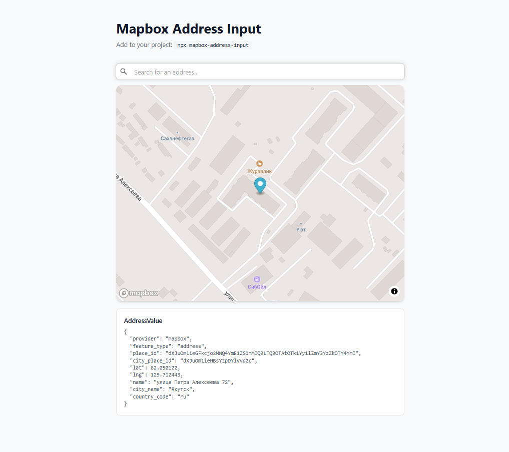

# mapbox-address-input

React-компонент для поиска адресов через Mapbox SearchBox с превью карты.

> [README in English](./README.md)

[](https://www.npmjs.com/package/mapbox-address-input)
[](https://mapbox-address-input.vercel.app/)



## Установка

Копирует папку `features/address-input/` прямо в твой проект — как shadcn:

```bash
npx mapbox-address-input
```

### Зависимости

```bash
npm install @mapbox/search-js-react @mapbox/search-js-core mapbox-gl
npm install -D @types/mapbox-gl
```

### CSS

Добавь в `globals.css`:

```css
@import "mapbox-gl/dist/mapbox-gl.css";
```

### Переменная окружения

```env
NEXT_PUBLIC_MAPBOX_TOKEN=pk.your_token_here
```

---

## Использование

### AddressInput

Поле поиска со встроенным превью карты.

```tsx
"use client";

import { useState } from "react";
import { AddressInput, type AddressValue } from "@/features/address-input";

export function MyForm() {
  const [address, setAddress] = useState<AddressValue | undefined>();

  return (
    <AddressInput
      accessToken={process.env.NEXT_PUBLIC_MAPBOX_TOKEN!}
      value={address}
      onChange={setAddress}
      onClear={() => setAddress(undefined)}
      placeholder="Введите адрес"
      mapClassName="h-48 w-full rounded-xl overflow-hidden"
    />
  );
}
```

### AddressMap

Отдельная карта без инпута — управляется снаружи.

```tsx
import { AddressMap } from "@/features/address-input";

<AddressMap
  accessToken={process.env.NEXT_PUBLIC_MAPBOX_TOKEN!}
  lat={address?.lat}
  lng={address?.lng}
  showMarker={address?.feature_type === "address"}
  featureType={address?.feature_type}
  className="h-64 w-full rounded-xl overflow-hidden"
/>
```

---

## API

### AddressInput

| Prop | Тип | По умолчанию | Описание |
|------|-----|--------------|----------|
| `accessToken` | `string` | — | Mapbox публичный токен |
| `value` | `AddressValue` | `undefined` | Текущее значение |
| `onChange` | `(v: AddressValue) => void` | — | Callback при выборе адреса |
| `onClear` | `() => void` | — | Callback при очистке |
| `placeholder` | `string` | — | Плейсхолдер поля |
| `types` | `string` | `"address,place,locality,district"` | Типы результатов Mapbox |
| `language` | `string` | из `navigator.language` | Язык результатов |
| `mapStyle` | `string` | `streets-v12` | Стиль карты |
| `className` | `string` | — | Класс внешнего контейнера |
| `mapClassName` | `string` | `"h-48 w-full rounded-lg overflow-hidden"` | Класс контейнера карты |

### AddressMap

| Prop | Тип | По умолчанию | Описание |
|------|-----|--------------|----------|
| `accessToken` | `string` | — | Mapbox публичный токен |
| `lat` | `number` | — | Широта |
| `lng` | `number` | — | Долгота |
| `showMarker` | `boolean` | `false` | Показывать маркер |
| `featureType` | `string` | — | Тип объекта (влияет на zoom) |
| `language` | `string` | — | Язык подписей карты |
| `mapStyle` | `string` | `streets-v12` | Стиль карты |
| `defaultCenter` | `[number, number]` | `[37.618, 55.752]` | Центр карты по умолчанию |
| `defaultZoom` | `number` | `10` | Zoom по умолчанию |
| `className` | `string` | — | Класс контейнера |

### AddressValue

```ts
interface AddressValue {
  provider: "mapbox";
  feature_type: string;   // "address" | "place" | "locality" | "district" | "region" | "country"
  place_id: string;       // ID адреса
  city_place_id: string;  // ID города
  lat: number;
  lng: number;
  name: string;           // "проспект Ленина, 1" или "Якутск"
  city_name: string;      // "Якутск"
  country_code: string;   // "RU"
}
```
